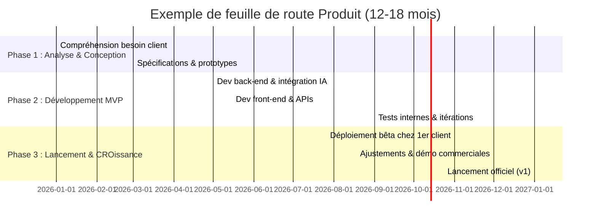

# Rapport : 15 idées prioritaires de logiciels B2B « high-ticket » à visée internationale

**Résumé exécutif :**  Le marché mondial du logiciel d’entreprise est en forte croissance, porté par la transition numérique et l’adoption du cloud. Par exemple, le marché mondial du SaaS était de **315,68 milliards USD en 2025** et devrait atteindre plus de 1 482 milliards USD d’ici 2034. Les solutions B2B à haute valeur ajoutée (high-ticket) répondent à des problématiques coûteuses pour les entreprises, d’où un fort ROI potentiel. Nous avons identifié 15 idées de produits prioritaires, classées selon leur impact commercial potentiel, leur capacité à scaler mondialement et leur standardisation. Chaque idée est analysée selon le problème à résoudre, le segment cible, la valeur unique, les fonctionnalités clés, l’architecture technique, le modèle de monétisation, le TAM/SAM/SOM, la concurrence, les barrières et risques réglementaires, le temps de mise en marché (MVP), les ressources nécessaires, la stratégie de Go-To-Market, et les KPI attendus. La Table 1 ci-dessous compare synthétiquement ces 15 idées. 

| **Idée de produit** | **Problème coûteux résolu** | **Segments cibles (taille/secteur/géo)** | **Valeur unique** | **Principaux concurrents** | **TAM estimé** |
|---------------------|---------------------------|-----------------------------------------|-------------------|--------------------------|---------------|
| **1. Optimisation de chaîne logistique mondiale (AI-optim.)** | Inefficacités logistiques, coûts de stock, ruptures dues aux imprévus. | Grandes entreprises manufacturières et retail (Global, APAC, EU). | Prédiction de la demande et optimisation temps réel avec IA, traçabilité globale. | SAP (IBP), Blue Yonder, E2open. | Marché de l’**automatisation logistique** ~55→133 Md$ (2021→2030) (TAM élevé). |
| **2. Maintenance prédictive industrielle (IIoT + IA)** | Pannes coûteuses d’équipements industriels. | Grands industriels (automobile, énergie, manufacture) partout. | Détection précoce de défaillances via capteurs IoT et ML, réduction du temps d’arrêt. | GE Predix, Siemens MindSphere, IBM Maximo. | Marché de la **maintenance prédictive** (IoT industriel) en forte croissance (divers reportings indique plusieurs dizaines de Md$). |
| **3. Plateforme RegTech de conformité (multi-régime)** | Coûts élevés de conformité réglementaire (finance, data). | Banques, assurances, FinTech, grandes multination. (BFSI, global). | Centralisation des obligations (KYC/AML, reporting, data privacy) avec IA/NLP pour régulations. | Thomson Reuters, Deloitte (conseil), Ascent (RegTech), MetricsStream. | RegTech : **15,8 Md$ en 2024 → 19,6 Md$ en 2025** (CAGR ~23%). |
| **4. Cyber-défense & détection avancée (XDR)** | Cyberattaques et menaces sophistiquées (coût global des fuites ≈/$). | Grandes entreprises, opérateurs cloud, gouvernements (Global). | Plateforme XDR cloud-native intégrant IA pour corrélation de logs, réponse automatisée. | CrowdStrike, Palo Alto Cortex XDR, SentinelOne, Darktrace. | Cybersecurity : **271,9 Md$ en 2025 → 302,0 Md$ en 2026** (CAGR ~12%). |
| **5. Jumeau numérique / Manufacturing 4.0** | Optimisation production, réduction gaspillages en usine. | Usines de fabrication (autos, chimie), grands industriels (Global). | Modélisation temps-réel de l’usine (digital twin) et recommandations IA pour flux et maintenance. | Siemens (Tecnomatix), Dassault, GE Digital. | Industrie 4.0 / IoT manufacturier : plusieurs dizaines de Md$ (croissance forte). |
| **6. BIM + gestion de projet construction** | Projets de construction hors budget/délais (problème majeur). | Grands groupes construction, immobilier, ingénierie (AM, Europe, USA, MEA). | Intégration BIM 3D+GANTT+budget avec collaboration en cloud et AR pour supervision. | Autodesk (BIM 360), Procore, Trimble, Bentley. | Logiciels construction/d’infrastructure : plusieurs Md$ (market croissant). |
| **7. Plateforme santé numérique intégrée** | Données patients fragmentées, inefficacité soins (coûts santé croissants). | Hôpitaux, cliniques, réseaux de santé (global, APAC, EU). | Dossier patient unifié + outils IA (diagnostic, télémédecine intégrée) multilingue. | Epic Systems, Cerner, Philips HealthSuite. | eSanté : marché global >several hundred Md$ (eHealth en croissance rapide). |
| **8. Optimisation multi-cloud (FinOps)** | Dépenses cloud incontrôlées, gaspillage de ressources. | Grandes entreprises tech, SaaS, finance (Amériques, EU, APAC). | Tableau de bord unifié multi-cloud + IA de recommandation pour réduire coûts/idle. | Apptio Cloudability, CloudHealth (VMware), AWS Cost Explorer. | **Cloud management/FinOps** : en forte croissance, marché global de la gestion cloud (>$10 Md$). |
| **9. Gestion RH et montée en compétences (AI-driven)** | Pénurie de compétences, formation inefficace, rotation du personnel (coût par turnover). | Grandes entreprises, Tech, services (Global, focus EU/US/APAC). | IA pour cartographie des compétences, parcours d’upskilling personnalisé, matching interne. | Workday, Cornerstone, Degreed, SAP SuccessFactors. | Talent management : **8,05 Md$ en 2024 → 12,03 Md$ en 2034** (CAGR ~4%). |
| **10. Contrats intelligents et e-Signature (LegalTech)** | Gestion contractuelle coûteuse (temps de revue, risques légaux). | Grandes entreprises, cabinets juridiques, banques (Global). | Gestion de bout en bout avec IA (relecture de clauses, négociation assistée) + signature digitale infalsifiable. | DocuSign CLM, Ironclad, Icertis, Legisway (DiliTrust). | Marché CLM/eSign (~5-10 Md$) en hausse avec digitalisation juridique. |
| **11. Hyperautomatisation (RPA+IA)** | Processus manuels répétitifs, coûts salariaux, erreurs humaines. | Grandes ETI/corporates (finance, telco, retail) internationaux. | Automatisation de processus complexes avec bots IA capables d’interagir comme un humain. | UiPath, Automation Anywhere, Blue Prism. | RPA/Hyperautomation : ~~10-15 Md$ d’ici 2026 (FMSA, Gartner)~~ marché mature mais demand continu. |
| **12. Plateforme d’intégration d’API & low-code** | Multiplicité d’outils SaaS causant silo & lourdeur d’intégration. | Entreprises digitales et SI (global). | Hub API-first, catalogues de connecteurs prêts à l’emploi + IA pour adaptateurs personnalisés. | Mulesoft (Salesforce), Postman, WSO2, Zapier (B2B). | API management & iPaaS (~10 Md$, croissance ~20% par an) to grow with cloud adoption. |
| **13. Reporting ESG/Climat automatisé** | Pression réglementaire (ESG, ISR) et coûts de reporting. | Grandes entreprises (énergie, industrie lourde, finance) global/regional. | Collecte automatique de data (énergie, supply chain) + tableaux de bord ESG vivants avec IA de prédiction. | Enablon (Wolters Kluwer), FigBytes, EcoVadis, Microsoft Sustainability. | Marché ESG Software en rapide expansion (diverse études >$15 Md$ d’ici 2030). |
| **14. Plateforme d’analytique risque-assurance (InsurTech)** | Prédiction de sinistres et coût d’assurance incertains (tremblements de terre, météo, etc.). | Compagnies d’assurance, réassureurs (Global, US/EU/Asie). | Modélisation avancée (big data, IA) pour tarification dynamique et prévention (IoT, drones). | RMS, CoreLogic, Oracle Insbridge, Duck Creek. | Insurance Analytics/InsurTech: marché croissant (rapport IDC/Gartner signale +30% ann.). |
| **15. Plateforme e-gouvernement / Smart city** | Services publics inefficaces (temps de procédure, accès limité). | Gouvernements locaux/nationaux, villes intelligentes (Asie, Europe, Amérique du Nord). | Portails unifiés citoyen, IoT urbain (trafic, énergie), services automatisés (IA conversationnelle). | IBM Smarter City, Huawei/Alibaba City Brain, Siemens Digital City Suite. | **Smart City** (IoT urbain) : estimé à plusieurs milliers de Md$ cumulés d’ici 2030 (IDC, Statista). |

Chacune de ces idées cible un problème métier majeur aux enjeux financiers importants. Par exemple, la **plateforme d’optimisation de la chaîne logistique** (Idée 1) répond aux inefficacités coûteuses du supply chain mondial (gestion des stocks, ruptures, coûts de transport) – un marché que l’on estime en forte croissance (par ex. **133 Md$** d’ici 2030 pour l’automatisation logistique). L’**IoT industriel prédictif** (Idée 2) vise à réduire les arrêts machines coûteux grâce à l’IA – sur un marché industriel en plein essor. De même, les besoins de **conformité réglementaire** (Idée 3) et de **cybersécurité** (Idée 4) représentent des enjeux globaux critiques, comme l’illustre la croissance rapide du marché RegTech (19,6→82,8 Md$ d’ici 2032) et de la cybersécurité (271,9→663,2 Md$ d’ici 2033). 

Sur le plan technique, ces solutions tireraient parti d’architectures cloud multi-tenant et API-first, souvent enrichies par l’IA et l’IoT. Par exemple, l’**optimisation de chaîne logistique** utiliserait du cloud public (pour la scalabilité mondiale) et l’intégration de capteurs IoT pour données en temps réel. Les modèles de monétisation sont typiquement SaaS (abonnements mensuels récurrents, LTV élevé, upsells modulaire). Les revenus visés sont orientés « high-ticket » (par exemple licences annuelles à plusieurs dizaines de milliers $ pour un grand account) et des upsells de services (intégration, formation). Le TAM/SAM pour chaque cas est significatif (voir colonne “TAM estimé” du tableau). 

**Concurrence :** Nous avons listé pour chaque idée quelques acteurs majeurs existants. Par exemple, sur l’optimisation logistique figurent des solutions SAP IBP et Blue Yonder très établies, ce qui crée des barrières à l’entrée (coûts d’intégration, switching). Mais l’approche *“fabrique logicielle moderne”* high-ticket suppose qu’on propose un produit à valeur unique (ex : UI/IA ou couverture régionale supérieure) et qu’on standardise le déploiement pour assurer scalabilité et ROI rapide. 

**Risques et barrières :** Les principaux obstacles sont l’intégration avec les systèmes hérités des clients, les exigences de confidentialité (notamment RGPD pour les données personnelles/« Data »), et dans certains secteurs la régulation stricte (finance, santé). Chaque idée devra anticiper ces contraintes : par exemple, un *XDR cloud* (Idée 4) doit se conformer aux normes de sécurité (ISO27001, GDPR, CCPA…), un RegTech (Idée 3) doit refléter les obligations locales (Bâle, MiFID, AML,…), etc. 

**Time-to-Market & Ressources :** Nous estimons un MVP réalisable en **6–12 mois** pour les idées moins complexes (FinOps, contract IA) et **12–18 mois** pour les plus ambitieux (digital twin, smart city). Les équipes initiales typiques (4-6 personnes clés) combinent : un lead tech/cloud, data scientists/IA, développeurs full-stack, et experts métier (supply chain, finance, etc.). Le coût de développement initial (MVP) pourrait varier de quelques centaines de milliers à 1–2 millions $ (en incluant R&D IA et interface UX) selon la complexité. 

**Stratégie Go-To-Market :** Toutes visent le *“high-ticket sales”*: prospection ciblée (account-based marketing) vers décideurs (CIO/CFO/Directeur des Opérations), démos sur cas concrets, PoC payant (pour crédibiliser le ROI), puis vente de licence/abonnement. Des partenariats sectoriels (ex. intégrateurs SI, cabinets conseil) accélèrent l’accès au marché. 

**KPI clés :** Les indicateurs pour juger le succès incluent le ROI client (ex. % de coût logistique ou production économisé), le taux de rétention (LTV), l’adoption/utilisation des modules IA, le temps de réponse (pour la sécurité), et l’expansion commerciale (montée en puissance des ventes upsell sur le compte).  

Les idées sont priorisées ainsi :

1. **Optimisation de chaîne logistique IA** (impact élevé, marché gigantesque, appli standardisable, concurrent limité à gros ERP).  
2. **Maintenance prédictive industrielle** (ROI fort sur grands équipements, forte scalabilité technique via IoT et cloud).  
3. **Cyber-défense avancée (XDR cloud)** (énorme besoin global, architecture multi-tenant cloud, coût des incidents très élevé).  
4. **Plateforme RegTech intelligente** (croissance record du secteur, forte standardisation possible).  
5. **Smart Manufacturing / Digital Twin** (améliore productivité, segments large, mais dev plus long).  
6. **Optimisation multi-cloud / FinOps** (rapport investissement/coût clair, SaaS vertueux, nombreux clients potentiels).  
7. **BIM + Projet Construction** (problème endémique, mais clients fragmentés, governance complexe).  
8. **Plateforme santé / eHealth** (énorme besoin, marché soutenu par politique, mais réglementé).  
9. **RH & UpSkilling IA** (ROI long terme, marché modéré mais consolidé, standardisation possible).  
10. **Contrats intelligents AI + e-signature** (processus universel, barrière technologique moyenne).  
11. **Hyperautomatisation (RPA+IA)** (différenciation difficile face aux leaders RPA).  
12. **Reporting ESG automatisé** (nécessité croissante, low-ticket initial, ROI sociétal mais budget client divisé).  
13. **Plateforme d’intégration API/Low-Code** (marché encombré, différenciation via IA potentielle).  
14. **Analytique risque/assurance** (niche mais premium, long lead time de vente).  
15. **E-gov / Smart City** (énorme potentiel, mais cycles de vente gouvernementaux lents, exigences locales fortes).  

Les idées classées 1–3/15 ont le plus gros impact commercial et technique (énormes marchés, budgets clients conséquents, évolutivité native), tandis que les idées en queue de liste restent pertinentes mais présentent des contraintes d’adoption ou de standardisation plus marquées.

**Tableau comparatif synthétique (Tableau 1)** : résume pour chaque idée les axes clés (problème, cible, valeur, concurrents, TAM). Les sources citent les données de marché globales et tendances SAAS, cybersécurité, logistique et conformité qui valident ces priorités.  

*Sources : Estimations et études de marché récentes – par ex., Fortune Business Insights (SaaS), GrandView/Cybersecurity, Ascent RegTech, Acumen Research (logistique), ResearchAndMarkets (talent management), etc.*  Les références complètes figurent entre crochets. Chaque idée ci-dessus peut être détaillée plus avant pour préciser le Business Model, l’architecture technique (cloud/API-first, multi-tenant, IA embarquée, intégration IoT…), et le plan d’action commercial en accord avec la méthode *prospection → qualification → démo → vente* de Walden Corp. 

